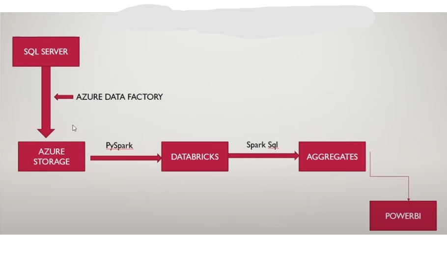

# Pizza-Sales-using-Databricks

## Introduction
In this project, I utilized Azure Databricks to analyze pizza sales data, leveraging SQL Server for database management, Azure Storage for secure data storage, and Power BI for dynamic visualizations. The project aimed to streamline data processing and uncover key sales insights.

## Architecture

## Technology Used
1. Programming Language - Python
2. Scripting Language - SQL
3. Microsoft Azure Platform
   - SQL Server
   - Azure Storage
   - Azure Databrocks
   - Power BI

## Dataset Used
This dataset provides detailed insights into pizza sales, capturing information on individual orders, including the quantity, pricing, and timing of each transaction. It also includes data on the size, category, and ingredients of the pizzas, making it well-suited for analyzing sales trends, customer preferences, and product performance.

## More Info About Dataset
Original Data Source- https://github.com/DewanjaliKapse/Pizza-Sales-suing-Databricks/blob/main/pizza_sales.csv
